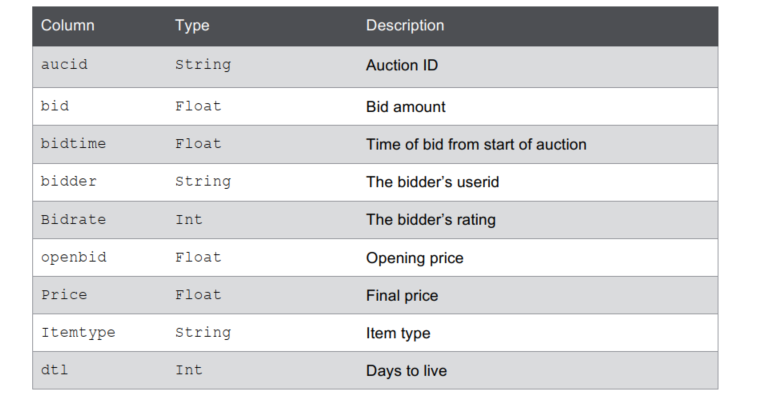
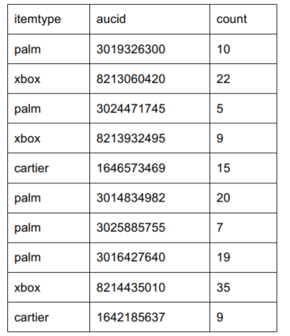
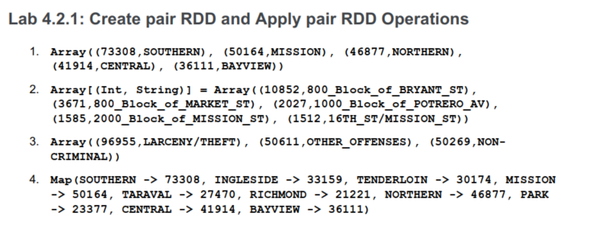
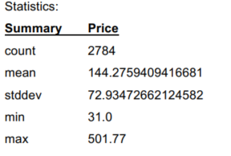

# Lab : Load and Inspect Data

#### Pre-reqs:
- Google Chrome (Recommended)

#### Lab Environment
There is no requirement for any setup.

**Note:** 
- Answers and solutions can be found in the files which are already opened in jupyertLab editor. Copy and paste the solution in the terminal(s) running spark-shell(Scala) or pyspark(Python).
- Elev8ed Notebooks (powered by Jupyter) will be accessible at the port given to you by your instructor. Password for jupyterLab : `1234`

All Notebooks are present in `work/spark-dev3600` folder. To copy and paste: use **Control-C** and to paste inside of a terminal, use **Control-V**

You can access jupyter lab at `<host-ip>:<port>/lab/workspaces/lab1`

<h4><span style="color:red;">Lab Overview </span></h4>

In this activity, you will load data into Apache Spark and inspect the data using the Spark interactive shell.
This lab consists of two sections. In the first section, we use the SparkContext method, textFile, to
load the data into a Resilient Distributed Dataset (RDD). In the second section, we load data into a
DataFrame.

### Scenario
Our dataset is a CSV file that consists of online auction data. Each auction has an auction ID associated
with it and can have multiple bids. Each row represents a bid. For each bid, we have the following
information:



We load this data into Spark first using RDDs and then using Spark DataFrames.
In both activities, we will use the Spark Interactive Shell.


You should see the data files there (auctiondata.csv, sfpd.csv, etc.).

### Lab 2.1: Load and Inspect Data with Spark Interactive Shell

**Objectives**

- Launch the Spark interactive shell
- Load data into Spark
- Use transformations and actions to inspect the data

### Lab 2.1.1: Launch the Spark Interactive Shell
The Spark interactive shell is available in Scala or Python.

**Note:** All instructions here are for Scala.

1. To launch the Interactive Shell, at the command line, run the following command:

`spark-shell --master local[2]`


**Note:** To quit the Scala Interactive shell, use the command
> `:q`

**Note:** There are four modes for running Spark. For training purposes, we are using local
mode. When you are running bigger applications, you should use a mode with a multiple VMs.

### Lab 2.1.2: Load Data into Apache Spark

The data we want to load is in the auctiondata.csv file. To load the data, we are going to use the
SparkContext method textFile. The SparkContext is available in the interactive shell as the
variable sc. We also want to split the file by the separator “,”.

1. We define the mapping for our input variables:

```
val aucid = 0
val bid = 1

val bidtime = 2
val bidder = 3

val bidderrate = 4
val openbid = 5
val price = 6

val itemtype = 7
val dtl = 8
```

2. To load data into Spark, at the Scala command prompt:

```
val auctionRDD =
sc.textFile("/home/jovyan/work/spark-dev3600/data/auctiondata.csv").map(_.split(","))
```

<span style="color:red;">Caution!</span> If you do not have the correct path to the file auctiondata.csv, you will get an error when you perform any actions on the RDD.

### Lab 2.1.3: Inspect the Data
Now that we have loaded the data into Spark, let’s learn a little more about the data. Find Answers
to the questions listed below.

What transformations and actions would you use in each case? Complete the command with the
appropriate transformations and actions.

1. How do you see the first element of the inputRDD?
auctionRDD.____________________
2. What do you use to see the first five elements of the RDD?
auctionRDD.____________________
3. What is the total number of bids?
val totbids = auctionRDD.__________________________________________
___________________________________________________________________
4. What is the total number of distinct items that were auctioned?
val totitems = auctionRDD._________________________________________
___________________________________________________________________
5. What is the total number of item types that were auctioned?
val totitemtype = auctionRDD.______________________________________
___________________________________________________________________
6. What is the total number of bids per item type?
val bids_itemtype = auctionRDD.____________________________________
___________________________________________________________________

We want to calculate the maximum, minimum, and average number of bids among all the auctioned
items.

7. Create an RDD that contains total bids for each auction.
val bidsAuctionRDD = auctionRDD.___________________________________
___________________________________________________________________
8. Across all auctioned items, what is the maximum number of bids? (HINT: if you use Math.max, then
use import java.lang.Math at the command line).
val maxbids = bidsItemRDD._________________________________________
9. Across all auctioned items, what is the minimum number of bids?
val minbids = bidsItemRDD._________________________________________
___________________________________________________________________
10. What is the average number of bids?
val avgbids = bidsItemRDD._________________________________________
___________________________________________________________________


**Note:** Find the <span style="color:red;">Answers</span>
and the solutions to the questions by referring to the files Lab2_1.scala (for Scala) or
Lab2_1.py (for Python).. The solutions in Scala and Python are provided.

<h4><span style="color:red;">Run Python Shell</span></h4>

To launch the Python shell: `pyspark`

### Lab 2.2: Use DataFrames to load data into Spark

Estimated time to complete: 30 minutes

**Objectives**

- Load data into Spark DataFrames using the Interactive Shell
- Explore the data in the DataFrame

**Note:** For a review on DataFrame actions and functions, refer to the Appendix.

### Lab 2.2.1: Load the data
There are different ways to load data into a Spark DataFrame. We use the same data that we used
before: auctiondata.csv. We load it into an RDD and then convert that RDD into a DataFrame. We
will use reflection to infer the schema. The entry point for DataFrames is SQLContext. To create a
basic SQLContext, we need a SparkContext. In the interactive shell, we already have the
SparkContext as the variable sc.

1. Launch the interactive shell:

`spark-shell --master local[2]`

2. Create a SQLContext:

`val sqlContext = new org.apache.spark.sql.SQLContext(sc)`

Since we are going to convert an RDD implicitly to a DataFrame:	

`import sqlContext.implicits._`

3. The Scala interface for Spark SQL supports automatically converting an RDD containing case
classes to a DataFrame. The case class defines the schema of the table. The names of the
arguments to the case class are read using reflection and become the names of the columns. In this
step, we will define the schema using the case class. Refer to the table describing the auction data in
the Scenario section.

```
case class Auctions(aucid:String, bid:Float,
bidtime:Float, bidder:String,bidrate:Int,
openbid:Float,price:Float, itemtype:String,dtl:Int)
```


4. Create an RDD inputRDD using sc.textFile to load the data from /home/jovyan/work/spark-dev3600/data/aucitondata.csv. Also, make sure that you split the input file based on the separator.

```
val inputRDD =
sc.textFile("/<path to file>/auctiondata.csv") .map(_.split(","))
```

5. Now, map the inputRDD to the case class.

```
val auctionsRDD = inputRDD.map(a=>Auctions(a(0),
a(1).toFloat,a(2).toFloat,a(3),a(4).toInt,
a(5).toFloat,a(6).toFloat,a(7),a(8).toInt))
```

6. We are going to convert the RDD into a DataFrame and register it as a table. Registering it as a
temporary table allows us to run SQL statements using the SQL methods provided by sqlContext.	

```
val auctionsDF = auctionsRDD.toDF()

//registering the DataFrame as a temporary table
auctionsDF.registerTempTable("auctionsDF")
```

7. What action can you use to check the data in the DataFrame?
auctionsDF.___________________________
8. What DataFrame function could you use to see the schema for the DataFrame?
AuctionsDF.___________________________


### Lab 2.2.2: Inspect the Data
We are going to query the DataFrame to gain more insight into our data.
1. What is the total number of bids?
auctionsDF.________________________________________________________
2. What is the number of distinct auctions?
auctionsDF.________________________________________________________
3. What is the number of distinct itemtypes?
auctionsDF.________________________________________________________


4. We would like a count of bids per auction and the item type (as shown below). How would you do
this? (HINT: Use groupBy.)



auctionsDF.________________________________________________________
___________________________________________________________________
5. For each auction item and item type, we want the max, min and average number of bids.
auctionsDF.________________________________________________________
___________________________________________________________________
6. For each auction item and item type, we want the following information (HINT: Use groupBy and
agg):

- Minimum bid
- Maximum bid
- Average bid

auctionsDF.________________________________________________________
___________________________________________________________________
7. What is the number of auctions with final price greater than 200?
auctionsDF.________________________________________________________

8. We want to run some basic statistics on all auctions that are of type xbox. What is one way of doing
this? (HINT: We have registered the DataFrame as a table so we can use SQL queries. The result
will be a DataFrame and we can apply actions to it.)
val xboxes = sqlContext.sql(_"SELECT_______________________________
___________________________________________________________________
9. We want to compute basic statistics on the final price (price column). What action could we use?
xboxes._______________________________


<h4><span style="color:red;">Answers</span></h4>

**Lab 2.1.3**

3. 10654
4. 627
5. 3
6. (palm,5917), (cartier,1953), (xbox,2784)
8. 75
9. 1
10. 16

**Lab 2.2.2**

1- 10654
2- 627
3- 3
5- MIN(count) =1; AVG(count)= 16.992025518341308; MAX(count) = 75
6- 

    

7- 7685
8- Statistics:

    


**Note:** Solutions are also in the file Lab2_1.scala from which you can copy and paste into the
Interactive shell.


1. auctionRDD.first
2. auctionRDD.take(5)
3. val totbids = auctionRDD.count()
4. val totitems = auctionRDD.map(_(aucid)).distinct.count()
5. val itemtypes = auctionRDD.map(_(itemtype)).distinct.count()
6. val bids_itemtype = auctionRDD
.map(x=>(x(itemtype),1)).reduceByKey((x,y)=>x+y).collect()
7. val bids_auctionRDD = auctionRDD
.map(x=>(x(aucid),1)).reduceByKey((x,y)=>x+y)
8. val maxbids = bids_auctionRDD
.map(x=>x._2).reduce((x,y)=>Math.max(x,y))
9. val minbids = bids_auctionRDD.map(x=>x._2)
.reduce((x,y)=>Math.min(x,y))
10. val avgbids = totbids/totitems


# Lab 2.1.3 – Python

To launch the Python shell,
$ `pyspark`

**Note:** Solutions are also in the file Lab2_1.py from which you can copy and paste into the
Interactive shell.

To map input variables:

```
auctioned = 0
bid = 1
bidtime = 2
bidder = 3
bidderrate = 4
openbid = 5
price = 6
itemtype = 7
dtl = 8
```

To load the file:

```
auctionRDD=sc.textFile("/path/to/file/auctiondata.csv").map(lambda
line:line.split(","))
```

1. auctionRDD.first
2. auctionRDD.take(5)
3. totbids = auctionRDD.count()
print totbids
4. totitems = auctionRDD.map(lambda line:line[aucid]).distinct().count()
print totitems
5. totitemtypes = auctionsRDD.map(lambda
line:line[itemtype]).distinct().count()
print totitemtypes
6. bids_itemtype = auctionRDD.map(lambda
x:(x[itemtype],1)).reduceByKey(lambda x,y:x+y).collect()
print bids_itemtype
7. bids_auctionRDD = auctionRDD.map(lambda
x:(x[aucid],1)).reduceByKey(lambda x,y:x+y)
bids_auctionRDD.take(5) #just to see the first 5 elements
8. maxbids = bids_auctionRDD.map(lambda x:x[bid]).reduce(max)
print maxbids
9. minbids = bids_auctionRDD.map(lambda x:x[bid]).reduce(min)
print minbids
10. avgbids = totbids/totitems
print avgbids

# Lab 2.2.2 – Scala

**Note:** Solutions are also in the file Lab2_2.scala from which you can copy and paste into the
Interactive shell.

1. val totalbids = auctionsDF.count()
2. val totalauctions = auctionsDF.select("aucid").distinct.count
3. val itemtypes = auctionsDF.select("itemtype").distinct.count
4. auctionsDF.groupBy("itemtype","aucid").count.show
(You can also use take(n))
5. auctionsDF.groupBy("itemtype", "aucid").count.agg(min("count"),
avg("count"), max("count")).show
6. auctionsDF.groupBy("itemtype", "aucid").agg(min("price"), max("price"),
avg("price"), min("openbid"), max("openbid"), min("dtl"),
count("price")).show
7. auctionsDF.filter(auctionsDF("price")>200).count()
8. val xboxes = sqlContext.sql("SELECT aucid,itemtype,bid,price,openbid
FROM auctionsDF WHERE itemtype='xbox'")
To compute statistics on the price column:
xboxes.select("auctionid", "price").distinct.describe("price").show

**Note:** Solutions for Python can be found in the file Lab2_2.py from which you can copy
and paste into the Interactive shell.


